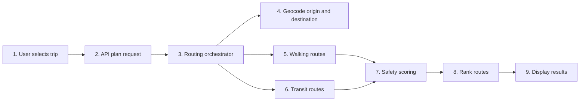
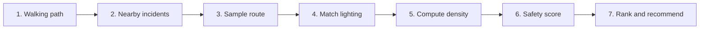
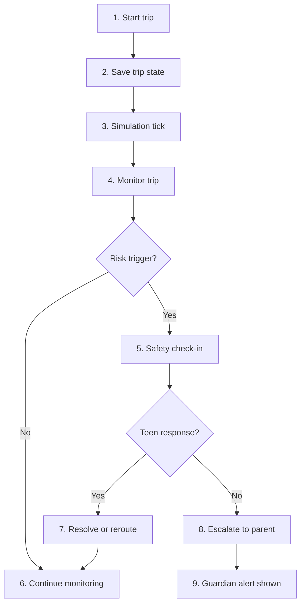
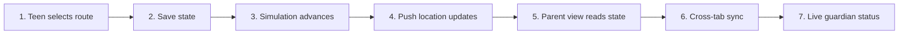

# Sentinel

Sentinel is a safety-first trip planner built for the gap between “I know where my teen is” and “I know whether the route is safe.” The app helps families compare safer walking and transit options, monitor a trip in progress, and escalate only when a check-in is missed or a direct help request is raised.

## Why this exists

Parents often have location visibility only after a problem has already started. Sentinel changes that pattern by combining route selection, incident awareness, and live check-ins so the teen can be warned early and the parent can intervene only when the risk is real.

This project was designed as a hackathon MVP focused on urban safety context rather than crime prediction. It does not claim to predict future harm. Instead, it ranks routes by recent incident density, lighting conditions, and trip behavior, then prompts check-ins at the exact moments when a route or stop becomes risky.

## What it does

- Compares walking and transit route choices in the planner UI, using the forms in [src/app/planner/page.jsx](src/app/planner/page.jsx) and [src/components/PlannerApp.jsx](src/components/PlannerApp.jsx).
- Resolves origins and destinations through geocoding and routing orchestration in [src/server/routing/index.js](src/server/routing/index.js), [src/server/routing/geocode.js](src/server/routing/geocode.js), [src/server/routing/valhalla.js](src/server/routing/valhalla.js), [src/server/routing/otp.js](src/server/routing/otp.js), and [src/server/routing/transitous.js](src/server/routing/transitous.js).
- Scores each route with local incident data and lighting data in [src/logic/safetyScoring.js](src/logic/safetyScoring.js) and [src/app/api/plan/route.js](src/app/api/plan/route.js).
- Tracks trip progress, route deviation, long stops, and missed check-ins in [src/actions.js](src/actions.js), [src/store.js](src/store.js), and [src/logic/tripMonitoring.js](src/logic/tripMonitoring.js).
- Simulates the teen trip and guardian alerts in the demo flow, with the live path model in [src/logic/simulation.js](src/logic/simulation.js).
- Keeps both teen and guardian views synchronized through shared application state in [src/store.js](src/store.js).

## High-level architecture

- UI shell: [src/App.jsx](src/App.jsx)
- Planner page: [src/app/planner/page.jsx](src/app/planner/page.jsx)
- Route planner screen: [src/components/PlannerApp.jsx](src/components/PlannerApp.jsx)
- Trip lifecycle and state actions: [src/actions.js](src/actions.js)
- State store and cross-tab sync: [src/store.js](src/store.js)
- Planner API contract: [src/app/api/plan/route.js](src/app/api/plan/route.js) and [src/app/api/routes/route.js](src/app/api/routes/route.js)
- Routing layer: [src/server/routing/index.js](src/server/routing/index.js)
- Safety scoring: [src/logic/safetyScoring.js](src/logic/safetyScoring.js)
- Monitoring and escalation: [src/logic/tripMonitoring.js](src/logic/tripMonitoring.js)
- Demo data: [src/data/incident_zones.json](src/data/incident_zones.json), [src/data/safe_places.json](src/data/safe_places.json), [src/data/demo_routes.json](src/data/demo_routes.json), and [src/data/redmondLightingSegments.json](src/data/redmondLightingSegments.json)

## How it works

### 1. Route planning and safety scoring



This path is the route-generation flow. The planner validates user input, resolves the places, requests candidate routes, and then applies a shared safety model to compare those routes before displaying the best option.

### 2. Safety scoring and incident weighting



The scoring logic is intentionally simple and explainable:

- Incidents are counted when they are close to the walk geometry.
- Route density is normalized by walking distance.
- Lighting is measured with equal-distance samples along the route.
- The final score is then compared across routes and recommended by rank.

### 3. Trip monitoring and escalation flow



The flow is intentionally conservative:

- Route deviation triggers a check-in when the teen is far from the planned route.
- A long stop triggers a check-in after a sustained idle period.
- A missed response escalates to the guardian with the context of the trigger.
- A manual SOS immediately raises an alert.

### 4. Demo simulation and real-time synchronization



This part is designed for the hackathon demo: one browser tab can show the teen experience while another shows the guardian dashboard, and both stay synchronized through shared app state.

## Key data and logic files

- Route safety calculation: [src/logic/safetyScoring.js](src/logic/safetyScoring.js)
- Route deviation and ETA logic: [src/logic/routeDeviation.js](src/logic/routeDeviation.js)
- Trip monitoring triggers: [src/logic/tripMonitoring.js](src/logic/tripMonitoring.js)
- Simulation of the walked path: [src/logic/simulation.js](src/logic/simulation.js)
- Shared trip actions: [src/actions.js](src/actions.js)
- Cross-tab state persistence: [src/store.js](src/store.js)
- Demo user data: [src/data/demo_users.json](src/data/demo_users.json)
- Safety context zones: [src/data/incident_zones.json](src/data/incident_zones.json)
- Trusted places: [src/data/safe_places.json](src/data/safe_places.json)
- Lighting snapshot: [src/data/redmondLightingSegments.json](src/data/redmondLightingSegments.json)

## Run locally

The project is a Next.js app. From the repository root:

```bash
npm install
npm run dev
```

The app runs on the default Next.js dev server at http://localhost:3000.

## Notes

- The route planner is built for Redmond-area safety context and demo use.
- The app uses live public routing and publicly available data sources where available, while keeping a local fallback for the demo environment.
- The trip status is intentionally simulated for a prototype experience rather than a production GPS background tracking system.
- Risk handling is centered on proactive check-ins and guardian visibility instead of silent background monitoring.
