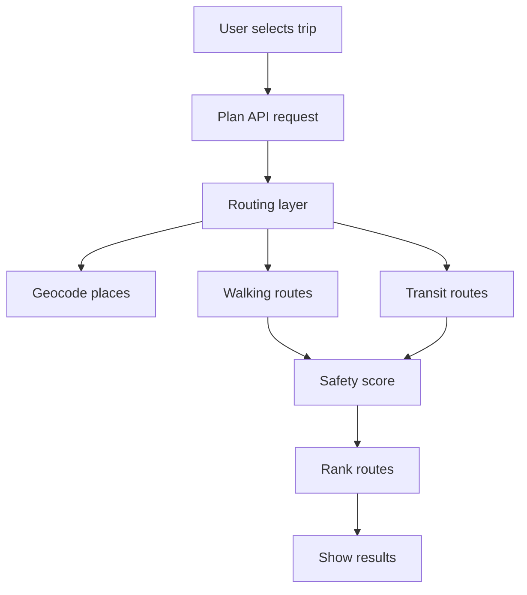
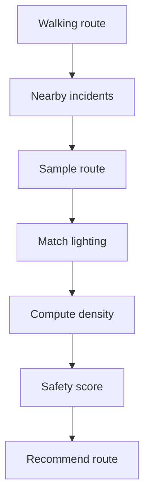
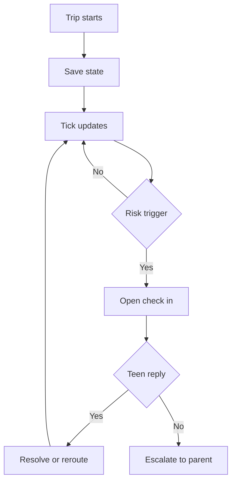
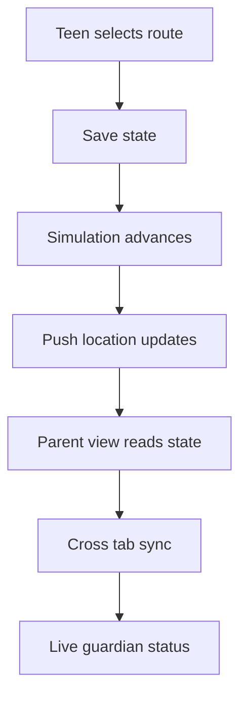

# Sentinel

Sentinel is a safety-first trip planner built for the gap between “I know where my teen is” and “I know whether the route is safe.” The app helps families compare safer walking and transit options, monitor a trip in progress, and escalate only when a check-in is missed or a direct help request is raised.

## Why this exists

Parents often have location visibility only after a problem has already started. Sentinel changes that pattern by combining route selection, incident awareness, and live check-ins so the teen can be warned early and the parent can intervene only when the risk is real.

This project was designed as a hackathon MVP focused on urban safety context rather than crime prediction. It does not claim to predict future harm. Instead, it ranks routes by recent incident density, lighting conditions, and trip behavior, then prompts check-ins at the exact moments when a route or stop becomes risky.

## What it does

- Compares walking and transit route choices in the planner UI, using the forms in [src/app/planner/page.jsx](src/app/planner/page.jsx) and [src/components/PlannerApp.jsx](src/components/PlannerApp.jsx).
- Resolves origins and destinations through geocoding and routing orchestration in [src/server/routing/index.js](src/server/routing/index.js), [src/server/routing/geocode.js](src/server/routing/geocode.js), [src/server/routing/valhalla.js](src/server/routing/valhalla.js), [src/server/routing/otp.js](src/server/routing/otp.js), and [src/server/routing/transitous.js](src/server/routing/transitous.js).
- Scores each route with local incident data and lighting data in [src/logic/safetyScoring.js](src/logic/safetyScoring.js) and [src/app/api/plan/route.js](src/app/api/plan/route.js).
- Tracks trip progress, route deviation, long stops, and missed check-ins in [src/actions.js](src/actions.js), [src/store.js](src/store.js), and [src/logic/tripMonitoring.js](src/logic/tripMonitoring.js).
- Simulates the teen trip and guardian alerts in the demo flow, with the live path model in [src/logic/simulation.js](src/logic/simulation.js).
- Keeps both teen and guardian views synchronized through shared application state in [src/store.js](src/store.js).

## High-level architecture

- UI shell: [src/App.jsx](src/App.jsx)
- Planner page: [src/app/planner/page.jsx](src/app/planner/page.jsx)
- Route planner screen: [src/components/PlannerApp.jsx](src/components/PlannerApp.jsx)
- Trip lifecycle and state actions: [src/actions.js](src/actions.js)
- State store and cross-tab sync: [src/store.js](src/store.js)
- Planner API contract: [src/app/api/plan/route.js](src/app/api/plan/route.js) and [src/app/api/routes/route.js](src/app/api/routes/route.js)
- Routing layer: [src/server/routing/index.js](src/server/routing/index.js)
- Safety scoring: [src/logic/safetyScoring.js](src/logic/safetyScoring.js)
- Monitoring and escalation: [src/logic/tripMonitoring.js](src/logic/tripMonitoring.js)
- Demo data: [src/data/incident_zones.json](src/data/incident_zones.json), [src/data/safe_places.json](src/data/safe_places.json), [src/data/demo_routes.json](src/data/demo_routes.json), and [src/data/redmondLightingSegments.json](src/data/redmondLightingSegments.json)

## How it works

### 1. Route planning and safety scoring



This path is the route-generation flow. The planner validates user input, resolves the places, requests candidate routes, and then applies a shared safety model to compare those routes before displaying the best option.

### 2. Safety scoring and incident weighting



The scoring logic is intentionally simple and explainable:

- Incidents are counted when they are close to the walk geometry.
- Route density is normalized by walking distance.
- Lighting is measured with equal-distance samples along the route.
- The final score is then compared across routes and recommended by rank.

### Exact weighting and score code

The pipeline is implemented in [src/logic/safetyScoring.js](src/logic/safetyScoring.js), and the route API assembles the route set and runs the scoring in [src/app/api/plan/route.js](src/app/api/plan/route.js).

The exact constants used in the implementation are:

```js
export const INCIDENT_POINTS_PER_INCIDENT_PER_KM = 0.03;
export const INCIDENT_CORRIDOR_METERS = 100;
```

The route score is calculated in this order:

1. Determine the walking-only path segments for the route.
2. Compute the total walking distance in kilometers.
3. Count unique incidents within 100 meters of the walk geometry.
4. Normalize that count into a density value:

```js
const density = lengthKm > 0 ? incidentCount / lengthKm : null;
```

5. Compute the incident penalty using the calibration constant 0.03:

```js
const incidentPoints = density === null ? null : Math.max(0, 10 - 0.03 * density);
```

6. Sample the route at equal-distance intervals and match each sample to the nearest lighting segment within 20 meters:

```js
const count = Math.ceil(length / 25);
const step = length / count;
```

This ensures lighting is evaluated based on a consistent sample spacing rather than provider vertex density.

7. Determine whether lighting data is available enough to rate the route at night:

```js
const lightingDataAvailable = total > 0 && known >= total / 2;
const unlitPercent = lightingDataAvailable ? Math.round(100 * unlit / known) : null;
```

8. Apply the final day or night formula:

```js
const score = incidentPoints === null ? null : safetyMode === 'night'
  ? incidentPoints / 2 + (lightingDataAvailable ? 5 * (1 - unlit / known) : 2.5)
  : incidentPoints;
```

So the actual weighting is:

- Day mode: safetyScore = max(0, 10 - 0.03 x incidentsPerKm)
- Night mode: safetyScore = (dayScore / 2) + lighting adjustment
- Lighting adjustment: 5 x (1 - unlitFraction), with a neutral fallback of 2.5 when lighting is unknown

The route list is then ranked by highest safety score first and shortest duration second:

```js
return [...routes].sort((a, b) =>
  (b.safetyScore ?? -1) - (a.safetyScore ?? -1) || a.durationMinutes - b.durationMinutes
)
```

This ranking behavior is implemented in [src/logic/safetyScoring.js](src/logic/safetyScoring.js) and is the reason the recommended route is the safest option when ties are broken by travel time.

### 3. Trip monitoring and escalation flow



The flow is intentionally conservative:

- Route deviation triggers a check-in when the teen is far from the planned route.
- A long stop triggers a check-in after a sustained idle period.
- A missed response escalates to the guardian with the context of the trigger.
- A manual SOS immediately raises an alert.

### 4. Demo simulation and real-time synchronization



This part is designed for the hackathon demo: one browser tab can show the teen experience while another shows the guardian dashboard, and both stay synchronized through shared app state.

## Key data and logic files

- Route safety calculation: [src/logic/safetyScoring.js](src/logic/safetyScoring.js)
- Route deviation and ETA logic: [src/logic/routeDeviation.js](src/logic/routeDeviation.js)
- Trip monitoring triggers: [src/logic/tripMonitoring.js](src/logic/tripMonitoring.js)
- Simulation of the walked path: [src/logic/simulation.js](src/logic/simulation.js)
- Shared trip actions: [src/actions.js](src/actions.js)
- Cross-tab state persistence: [src/store.js](src/store.js)
- Demo user data: [src/data/demo_users.json](src/data/demo_users.json)
- Safety context zones: [src/data/incident_zones.json](src/data/incident_zones.json)
- Trusted places: [src/data/safe_places.json](src/data/safe_places.json)
- Lighting snapshot: [src/data/redmondLightingSegments.json](src/data/redmondLightingSegments.json)

## Run locally

The project is a Next.js app. From the repository root:

```bash
npm install
npm run dev
```

The app runs on the default Next.js dev server at http://localhost:3000.

## FAQ

<details>
<summary>Why not just use a simple shortest-path route?</summary>

Because the shortest route is often the one with the worst recent incident density or worst lighting. In the score logic in [src/logic/safetyScoring.js](src/logic/safetyScoring.js), a route can be ranked lower even if it is slightly longer when it has fewer nearby incidents and better lighting coverage.

Example: a 12-minute route with 20 incidents per kilometer may score worse than a 16-minute route with 5 incidents per kilometer. The app intentionally prefers the safer route unless the safety difference is negligible.
</details>

<details>
<summary>How does the app decide whether a route is safe?</summary>

It combines three factors:

- incident density near the path
- lighting coverage on the walk
- trip behavior while the teen is moving

The incident branch is implemented in [src/logic/safetyScoring.js](src/logic/safetyScoring.js), while the live monitoring logic is in [src/logic/tripMonitoring.js](src/logic/tripMonitoring.js). A route with a higher safety score is preferred, but a route can also become risky after the trip starts if the teen drifts off-course or stops for too long.
</details>

<details>
<summary>Why is the scoring formula not more complex?</summary>

This is a hackathon MVP, so the goal was to make the model understandable and auditable. The score is a transparent weighted heuristic rather than a black-box model.

A simple example: if a route has 20 incidents per kilometer, then the incident contribution is roughly:

```js
10 - 0.03 * 20 = 9.4
```

That means the score drops as incident density rises, but it stays interpretable. Judges can look at the code and understand exactly why a route gets a lower score.
</details>

<details>
<summary>What happens when the app does not have good lighting data?</summary>

The system treats missing lighting tags as unknown, not automatically unlit. This is visible in [src/logic/safetyScoring.js](src/logic/safetyScoring.js): the code only marks the route as unlit if the segment is explicitly tagged as `no`, and it falls back to a neutral score when lighting coverage is insufficient.

Example: if a route has only 30% valid lighting data, the app does not claim it is dark everywhere; it uses the neutral night fallback instead of over-penalizing the route.
</details>

<details>
<summary>Why would a trip trigger a check-in even when the teen is still moving?</summary>

Because the app is monitoring behavior, not just raw coordinates. In [src/logic/tripMonitoring.js](src/logic/tripMonitoring.js), a route deviation, long stop, late arrival, or nearby risk-zone trigger can create a check-in even when the teen has not called for help yet.

Example: a teen leaves the planned route by 350 meters for more than two minutes will receive a check-in asking, “You left the planned route. Are you okay?”
</details>

<details>
<summary>What is the difference between a risk score and a live trip alert?</summary>

The safety score is a route-level prediction of how exposed the path is. The live alert is a real-time behavioral trigger while the trip is in progress.

Example: a route can get a 6.8 safety score before departure, but once the teen stops moving for several minutes, the system may trigger a long-stop check-in even if the base route score was initially acceptable.
</details>

<details>
<summary>How do we know this is not just a simulator or a toy app?</summary>

The implementation uses real routing and geocoding orchestration, plus route scoring and live trip-state transitions. The route API orchestrates providers in [src/server/routing/index.js](src/server/routing/index.js), geocoding is handled in [src/server/routing/geocode.js](src/server/routing/geocode.js), and public routing logic lives in [src/server/routing/valhalla.js](src/server/routing/valhalla.js) and [src/server/routing/transitous.js](src/server/routing/transitous.js).

Example: a real origin and destination are resolved to coordinates before the route score is computed; the app is not just hard-coded to a single path.
</details>

<details>
<summary>Why use a parent check-in instead of pushing an alert immediately?</summary>

Because the product is designed around human-in-the-loop safety. The teen is asked first before escalating to the guardian, which reduces false alarms and keeps the workflow respectful.

Example: if the teen misses a check-in after a deviation warning, the app escalates to the parent with a high-severity alert. If the teen answers “I’m okay,” the trip continues without escalation.
</details>

## Notes

- The route planner is built for Redmond-area safety context and demo use.
- The app uses live public routing and publicly available data sources where available, while keeping a local fallback for the demo environment.
- The trip status is intentionally simulated for a prototype experience rather than a production GPS background tracking system.
- Risk handling is centered on proactive check-ins and guardian visibility instead of silent background monitoring.
